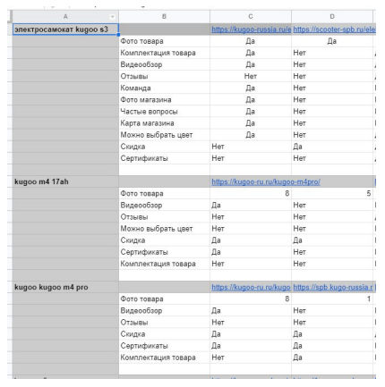

# Анализ конкурентов
Сравнивайте ресурсы примерно одинакового размера, ассортимента, со схожими типами контента. Бессмысленно сравнивать локальный онлайн-магазин, с федеральной сетью.

- постраничное (on page) сравнение продвигаемого сайта и сайта конкурента;
- анализ репутации - проверка и сравнение рейтинга своего сайта и конкурентов на площадках-отзовиках;
- составление матрицы со всеми собранными данными для удобства внедрения доработок.

Можно организовать матрицу так: ключ, ссылка на сайт-конкурент, наличие/отсутствие коммерческих факторов по списку. Такая таблица даст наглядное представление о факторах, которые нуждаются в проработке на продвигаемом сайте:

Таблица:

