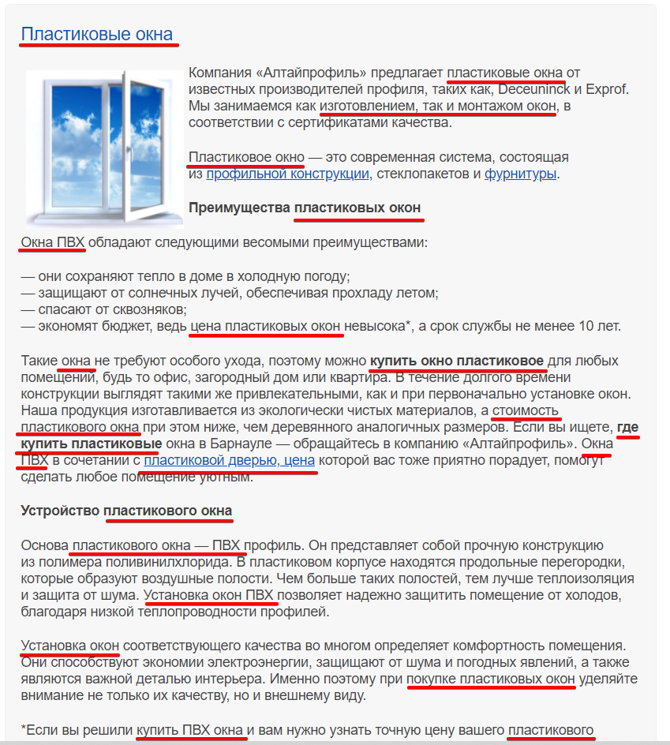

# Контентные факторы ранжирования
- Мета-теги
- Текст
- Изображения
- Видео

## Чек-лист
- Одна статья - одно коммерческое предложение,
- Текст структурирован, в заголовки H1-H6 вписаны ключевые слова,
- Текст разделен на небольшие абзацы, в нем нет ошибок,
- Текст получил до 7 баллов по "Главреду" или до 5 - по "Тургеневу",
- Уникальность текста - от 90% по text.ru,
- Классическая тошнота - до 4%, академическая - до 8.5% по Advego,
- В тексте нет воды - бесполезной информации,
- Есть фото, скриншоты, видео,
- Один шрифт и один цвет символов.

## Текстовые факторы ранжирования
- релевантность - степень соответствия содержимого выдаваемой страницы запросу пользователей,
- лемматизация - лемма, это начальная форма слова (им.п., ед.ч. для существительных и прилагательных, инфинитив для глаголов):
  - Яндекс хранит тексты в виде лемм,
  - Гугл применяет лематизацию к запросу или может не применить,
- желательно, чтобы слова из одного запроса находились близко друг к другу, а наиболее важные ключи были ближе к началу текста.

Слова, совпадающие с запросами, полезно размещать:
- В метатегах (title, description, keywords),
- Заголовках любого уровня,
- Названиях и описаниях товаров в листинге интернет-магазина,
- Анкорах ссылок,
- URL-адресах,
- Атрибутах изображений: alt, title.

Плотность ключей не должна быть слишком большой, пример переоптимизации:

- плотность ключей должна быть 2-4%, соотношение количества ключевых слов к объему текста (при этом в тексте не должно быть других слов, которые встречаются чаще, чем запросы, под которые оптимизируется страница)
- что слова в ключевых фразах желательно склонять, спрягать, менять местами и разбавлять другими словами для естественности,
- наличие LSI-слов также свидетельствует о естественности текста.

## Ссылки:
- https://ant-team.ru/blog/mezhdu-dvux-stulev-kak-napisat-text-kotoryj-ponravitsya-i-poiskovoj-sisteme-i-cheloveku/
- https://ant-team.ru/blog/tekstovye-faktory-ranzhirovaniya-bazovyj-kurs-po-seo-prodvizheniyu-lekcziya-1/
- https://www.ashmanov.com/education/articles/kak-rabotayut-tekstovye-faktory-ranzhirovaniya-v-algoritmakh-poiska-yandeks-i-google/
