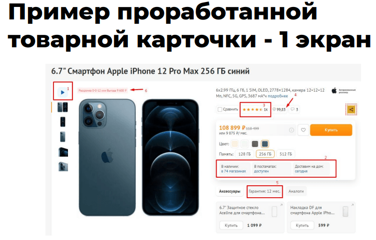
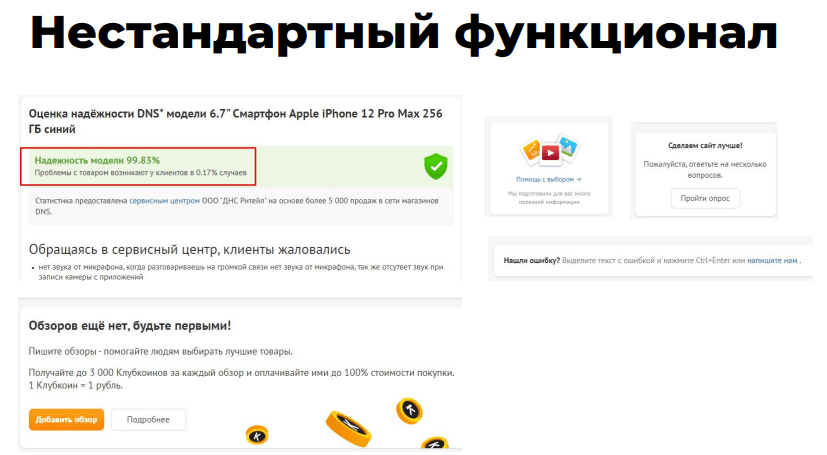

# Товарная карточка
На стадии работы над коммерческими факторами товарной карточки вы уже определили основные характеристики для каждого товара. Снимите частотность этих характеристик и используйте самые частотные в качестве фильтров товарной категории или каталога в целом.

Чек-лист товарной карточки (первый экран):

- Рейтинг
- Цена
- Фото и видео
- Информация о наличии
- Гарантии
- Доставка
- Рассрочка

Пример хорошей карточки (первый экран):

Последующие экраны:
- Описание товара,
- Товарные характеристики,
- Отзывы с рейтингом.

## Нестандартный функционал
Оценка надежности товара:

## Ссылки:
- https://blog.promopult.ru/sales/10-priznakov-pravilnoj-kartochki-tovara.html
- https://vc.ru/seo/90124-chek-list-dlya-tovarnoy-kartochki
- https://blog.promopult.ru/sales/texnologii-apsejla-i-krossejla.html
