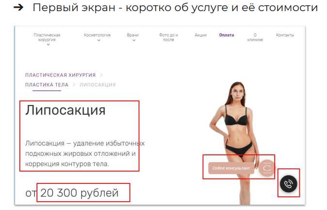
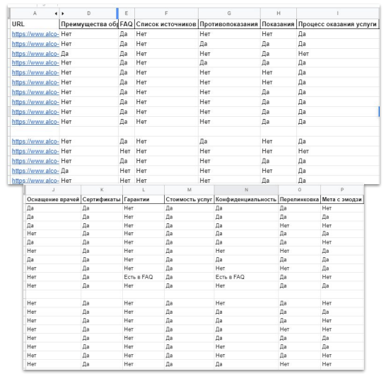
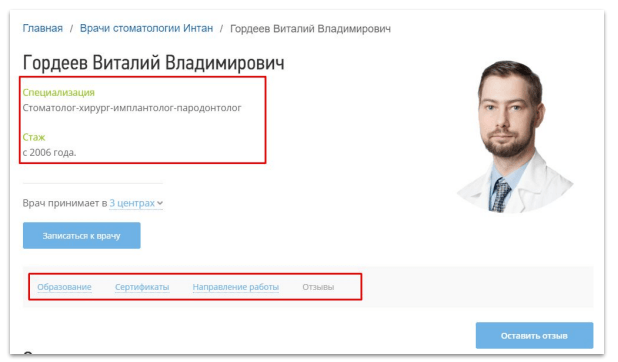

# Коммерческие факторы (сайт услуг)
Коммерческие факторы на сайтах услуг

Если интернет-магазин может выделиться среди конкурентов прежде всего ассортиментом и ценами, то сайт услуг - **экспертным контентом**.

Какие типы контента должны быть на сайте услуг:

- Результаты до/после (как правило, фото).
- Видео процесса оказания услуги.
- Раздел о сотрудниках компании, их характеристики и достижения.
- Информация об экспертах компании.
- Калькуляторы и различные интерактивные элементы (3D-конструктор мебели на заказ, расчет стоимости уборки в зависимости от площади квартиры и т.п.).
- Снятие потенциальных страхов клиентов в форме FAQ и отзывов

## Структура страницы услуги
Вот блоки и элементы, которые структурируют контент на странице услуги и помогут пользователю определиться с заказом:

- Оглавление (навигация по странице, если представлен большой объем информации).
- Подробное, понятное, структурированное описание услуги.
- Стоимость.
- Сроки оказания услуги.
- Видео процесса оказания услуги.
- CTA-кнопка ("Заказать", "Связаться со специалистом").
- Автор услуги (если это важно, например, на сайтах клиник указывают врача, салонов красоты - косметолога).
- Эксперт об услуге.
- Часто задаваемые вопросы.
- Гарантируемый результат.
- Отзывы и рейтинг.
- Дополнительные релевантные услуги.
- Возможность позвонить, быстро написать в мессенджер или онлайн-консультант.

Вот пример первого экрана страницы услуги на сайте клиники пластической хирургии - есть название, краткое описание, цена, возможность задать вопрос онлайн-консультанту:

## Матрица
Матрица для каждой услуги:

Для сфер, в которых экспертиза исполнителя играет ключевую роль (косметология, психология, массаж, медицина, образование, юридические и финансовые услуги и др.), важно максимально подробно рассказать о каждом сотруднике на специальной посадочной странице:

